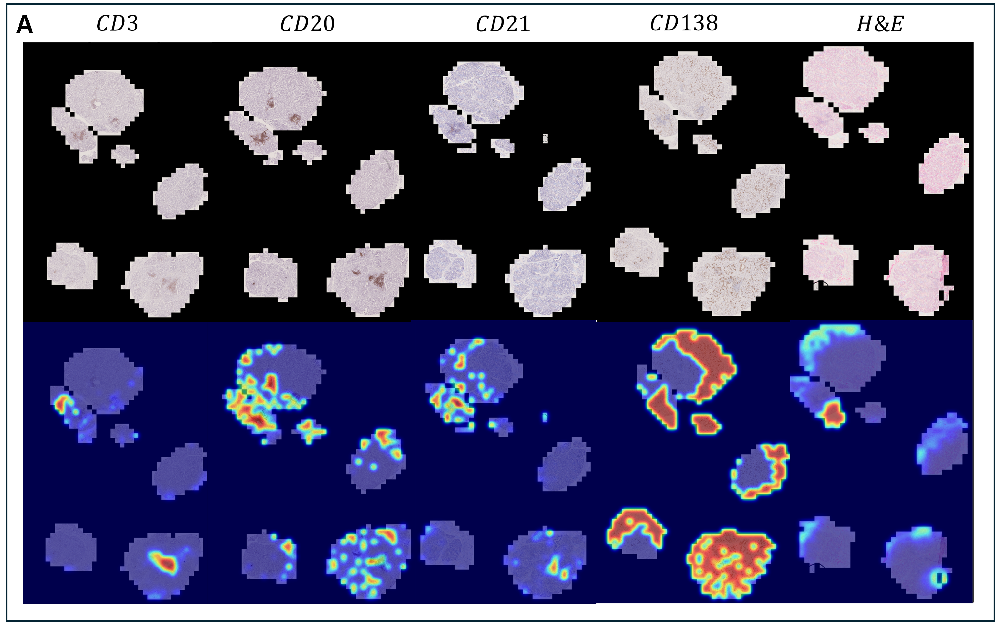

[](https://doi.org/10.1101/2021.01.08.)

# BioX-CPath

**We introduce BioX-CPath, an interpretable graph neural network for multistain pathology that achieves state-of-the-art performance while providing biological insights through a novel stain-aware attention mechanism.**

## Overview 

The development of biologically interpretable and explainable models remains a key challenge in computational pathology, particularly for multistain immunohistochemistry (IHC) analysis. We present BioX-CPath, an explainable graph neural network architecture for whole slide image (WSI) classification that leverages both spatial and semantic features across multiple stains. At its core, BioX-CPath introduces a novel Stain-Aware Attention Pooling (SAAP) module that generates biologically meaningful, stain-aware patient embeddings. Our approach achieves state-of-the-art performance on both Rheumatoid Arthritis and Sjogren's Disease multistain datasets. Beyond performance metrics, BioX-CPath provides interpretable insights through stain attention scores, entropy measures, and stain interaction scores, that permit measuring model alignment with known pathological mechanisms. This biological grounding, combined with strong classification performance, makes BioX-CPath particularly suitable for clinical applications where interpretability is key. 


### Pipeline

- **Segmentation.** A automated tissue segmentation step, using adaptive thresholding to segment tissue areas on the WSIs.
- **Patching.** After segmentation, the tissue area is divided into patches at a size chosen by the user (eg. 224 x 224), which can be overlapping or non-overlapping.
- **Coordinates extraction.** For each patch, the (x,y)-coordinates are saved to a .csv file from the tissue segmentation.
- **Feature extraction.** Each image patch is passed through a CNN feature extractor and embedded into [1 \times 1024] feature vectors. All feature vectors from a given patient are aggregated into a matrix. The number of rows in the matrix will vary as each patient has a variable set of WSIs, each with their own dimensions.
- **Adjacency matrix construction.** The patch coordinates are used to create a region Adjacency matrix A_{RAG}, where edges existing between spatially adjacent patches are 1 if they are spatially adjacent and 0 otherwise. The matrix of feature vectors is used to calculate the pairwise Euclidean distance between all patches. The top-k nearest neighbours in feature space are selected and a KNN Adjacency matrix A_{KNN} is created, where the edges between the k-nearest neighbours is 1 and 0 otherwise.
- **Graph construction** The Adjacency matrices A_{RA} and A_{KNN} are summed, with shared edges reset to 1, creating an Adjacency matrix A_{KRAG}. For each patient a directed, unweighted KNN+RA graph is initialised using the adjacency matrix A_{KRAG}, combining both local - RA - and global - KNN - information.
- **Random Walk positional encoding.** For each node in the graph, a random walk of fixed length k is performed, starting from a given node and considering only the landing probability of transitioning back to the node i itself at each step.
- **Hierarchical Graph classification.** The KRAG is successively passed through four Graph Attention Network layers (GAT) and SAGPooling layers. The SAGPooling readouts from each layer are concatenated and passed through three MLP layers. This concatenated vector is passed through a self-attention head and finally classified.
- **Heatmap generation.** Sagpool scores.

## Setup

First clone the repository to the desire location and enter the directory:

```bash
# clone project to desired location
git clone https://github.com/AmayaGS/BioX-CPath
cd BioX-CPath
```

Then create a virtual environmemt and install the requirements.txt

#### General Requirements
- Python 3.11.7
- PyTorch 2.5
- NVIDIA GPU with CUDA 12.4

```bash
# Virtual Environment
python -m venv bioxcpath
source bioxcpath/bin/activate

# PyTorch with cuda capabilities
pip install torch==2.5.1 torchvision==0.20.1 --index-url https://download.pytorch.org/whl/cu124

pip install -r requirements.txt  

```

## Usage

### Data Preprocessing

During preprocessing, the following steps are performed: **tissue segmentation**, **patching**, **feature extraction**, **adjacency matrix construction**, and **graph construction**. Finally, **random walk positional encoding** is pre-computed on the generated graphs and stored as a pytorch geometric transform. 

#### Arguments

All arguments used to run the code are defined using `Argument parser` and can be modified using the command line.

#### Data Directory Structure

The WSIs should be stored in a directory structure as shown below. The `slides` folder is the `input_directory`, which the `config` file should point to. It should contain all the WSIs for each patient, with the naming convention `patientID_staintype.tiff`. The `patient_labels.csv` file should contain the patient IDs and the target labels for the task:

```
--- Dataset_name
    patient_labels.csv
    --- slides
            --- patient1_HE.tiff
            --- patient1_CD3.tiff
            --- patient1_CD138.tiff
                .
                .
            --- patientN_HE.tiff
            --- patientN_CD138.tiff
```

Preprocessing can be run using the following command:

```bash
python main.py --preprocess --input_directory path/to/slides --directory path/to/output --dataset_name dataset_name
```
`--preprocess` will create 4 new folders: output, dictionaries, masks, contours.

- `masks` contains all the downsampled binary masks obtained during tissue segmentation. 

- `Contours` contain downsampled WSIs with mask contours drawn on thumbnails of the WSIs as a sanity check. You can easily check you're segmenting the right thing and that there's no issues with the WSIs themselves.

- `output` contains the patches folder, containing all the extracted patches, as well as the `extracted_patches.csv` file which contains all the patient_IDs, filenames, coordinates and locations on disk of the patches extracted during the tissue segmentation step.  

- `dictionaries` contains pickled dictionaries of the embedded feature vectors, graphs with random walk positional encodings for each patient.

Alternatively, each step can be run separately (if you already have binary masks or embedded feature vectors for example) using the following commands:

```bash
python main.py --segmentation # tissue segmentation
python main.py --embedding # Feature extraction and graph construction
python main.py --compute_rwpe # Random walk positional encoding
```

### Training & Testing


#### Model Training

Training is run using the following command:

```bash
python main.py --train --input_directory path/to/slides --directory path/to/output --dataset_name dataset_name
```

The results will be stored in the `output` directory. There you will find training/validation logs for each fold + summary statistics, as well as model weights in the `checkpoints` folder.

Additional training parameters can be set using command-line arguments. For a full list of options, run:

```bash
python main.py --help
```

#### Model Testing

Testing is run on the different hold-out folds using the following command:

```bash
python main.py --test --directory path/to/output --dataset_name dataset_name
```

This will test the corresponding model weights on the hold-out test set and store final results in the `output` directory.

### Heatmap Generation

Heatmaps can be generated using the following command:

```bash
python main.py --heatmap --directory path/to/output --dataset_name dataset_name --path_to_patches path/to/patches --heatmap_path path/to/save/heatmaps
```

This will generate smoothed heatmaps for the test folds using the trained model weights and store them in the `heatmap_path` directory. Heatmaps maps can be examined overall or for each layer of the model, as shown below:



